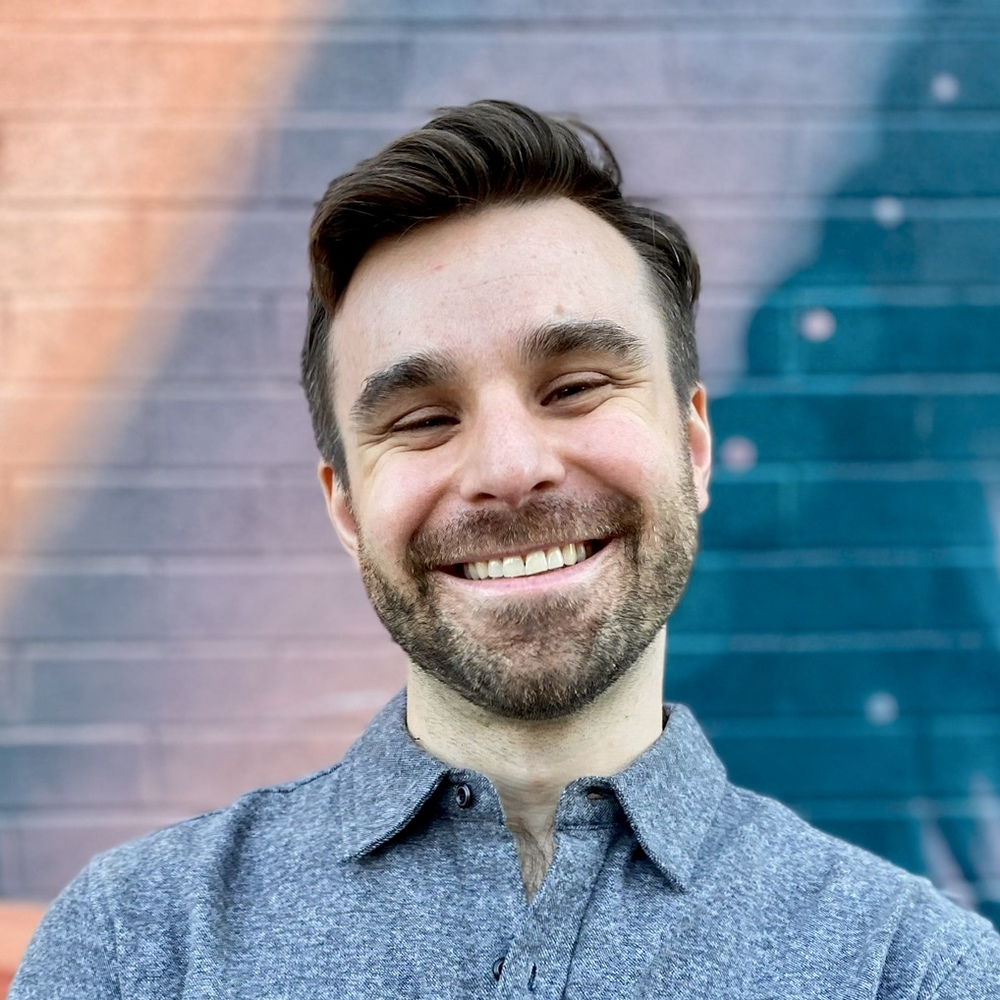
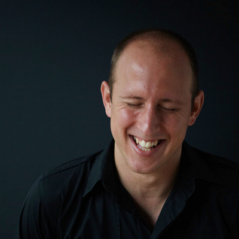
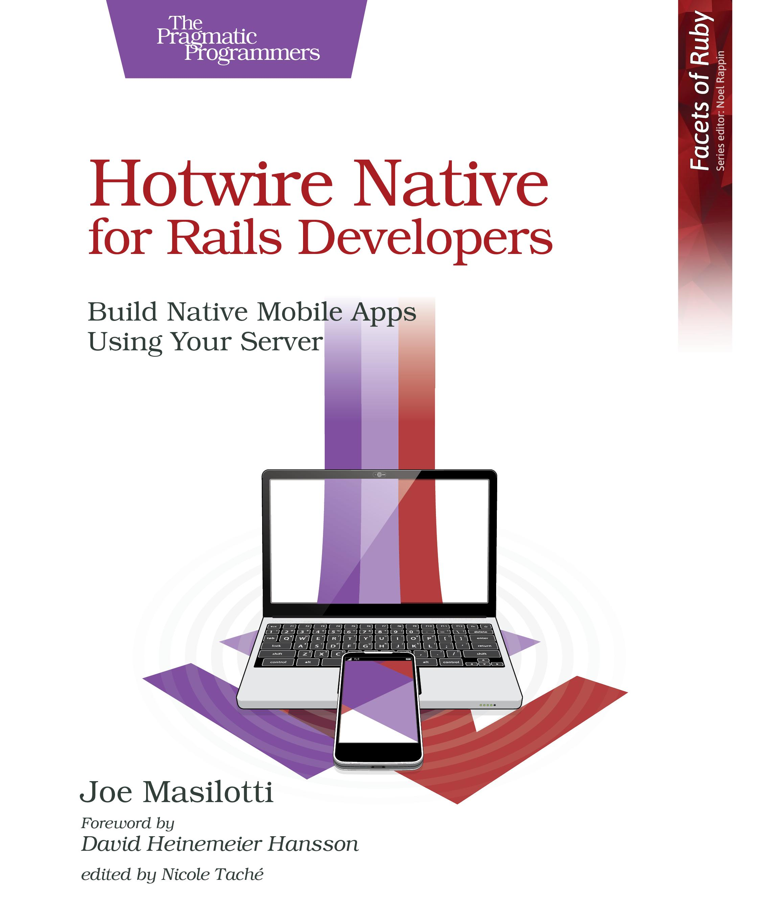
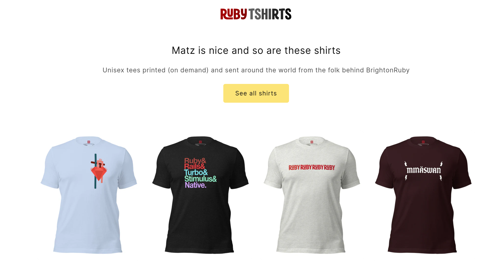
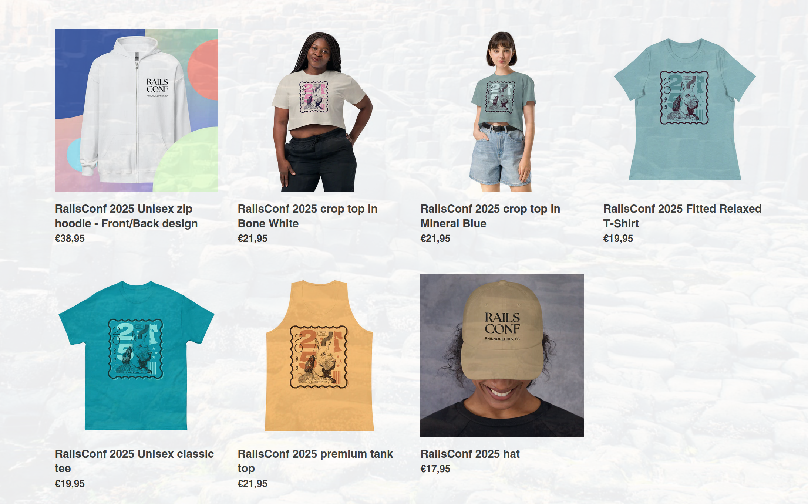
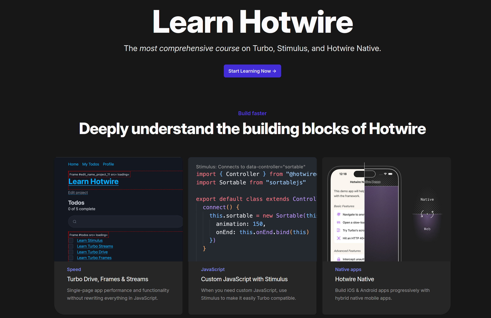

# Vienna.rb #64

## The Ruby Summer Meetup 🌴

---

Speakers Img

---
layout: center
class: bg-white
---

---

---

# Ruby Quiz! 🏆

---

## Community Sponsors 🙌

---

# Quiz Time!

---

## Third Place 🥉

Thank you to Joe Masilotti!

https://masilotti.com/

---

## Second Place 🥈

Thank you to Andy Croll!

Check out https://rubytshirts.com/ & https://andycroll.com/

---

## Second Place 🥈

Thank you to Ally Vogel & Ruby Central!

Check out https://store.rubycentral.org

---

## First Place 🥇

Thank you to Chris Oliver!

Visit https://learnhotwire.com/

---

## Participation Trophy 🏆

50% off Learn Hotwire for Vienna.rb with Code:

### HASQCD2G
