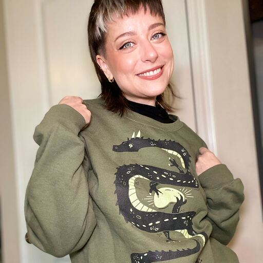

# Vienna.rb #64

## The Ruby Summer Meetup 🌴

---
layout: image
image: /img/talks.webp
---

---
layout: two-cols
---

::right::

---
layout: center
class: bg-white
backgroundSize: contain
---

---
layout: center
class: bg-white
backgroundSize: contain
---

---

---
layout: intro
class: text-center
---

# Ruby Quiz! 🏆

---

## Community Sponsors 🙌

---
layout: intro
class: text-center
---

# Quiz Time!

---

# Third Place 🥉

Thank you to Joe Masilotti!

https://masilotti.com/

---

# Second Place 🥈

Thank you to Andy Croll!

Check out https://rubytshirts.com/ & https://andycroll.com/

---

# Second Place 🥈

Thank you to Ally Vogel & Ruby Central!

Check out https://store.rubycentral.org

---

# First Place 🥇

Thank you to Chris Oliver!

Visit https://learnhotwire.com/

---
class: text-center
---

# Participation Trophy 🏆

50% off Learn Hotwire for Vienna.rb with Code

### HASQCD2G
